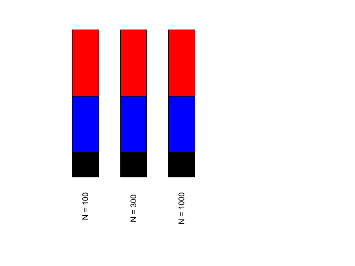

# When the Strongest Survive in n Person duels
## Neel Dhulipala, Hazel Smith
## Abstract
In this project, we plan to explore the outcomes of n-person duels. Traditional game theory suggests that in a truel, the strongest player has the highest probability of being eliminated first since the two weakest players would likely team up against the strongest player for their gain. However, in scale-free networks, where each competitor is represented by a node, this paradox holds untrue in both single-run and Monte-Carlo simulations, according to [1]. We plan to use the NetworkX library to create Barabasi-Albert graphs with similar properties to such scale-free networks, and through these simulations, we aim on exploring why these outcomes are true.
## Annotated Bibliography
“The Good, The Bad, The Well-Connected
[1] Wegener, M., Mutlu, E. The good, the bad, the well-connected. Int J Game Theory 50, 759–771 (2021). https://doi.org/10.1007/s00182-021-00765-1
Added by David Tarazi
The authors present a question about the survival probability of players/competitors in truels (duels with 3 participants). While some suggest that in a singular truel with one strongest player, that strongest player has the least likelihood of survival since the other two players will target that player first, Wegerer and Mutlu find that this may not hold at scale. Through the usage of scale-free networks, they model the outcomes of many truels to predict survival probabilities for many different truels leading into each other. Using different probabilities and marksmanship abilities, this model can be simulated for prediction. There is room to explore different ways to approach the way the truel is simulated and add players to make quadruels.”
## Experiment
- Create a BA graph with 300 nodes
- Assign each player(node) a marksmanship, “which can take on one of the three possible values: [0.5, 0.8, 1]. Marksmanship levels are randomly distributed in the network with equal initial proportions.”
- “At each step in the game: one node is chosen randomly. 
	- This chosen player, in turn, randomly selects two opponents among his neighbour nodes, and the three players play a sequential truel with a fixed shooting order. 
	- However, if the initially chosen player has only one neighbour, a duel occurs. 
	- Moreover, players are assumed to be rational (i.e., they strictly follow the strongest opponent strategy but never aim at a player of the same type). 
	- Finally, the losers of either a truel or a duel are removed from the network, and if a node has no neighbours left, it will be reattached to the network along the lines of the preferential-attachment algorithm that was used to create the scale-free network.
	- In the unlikely event that no strongest player exists because all players chosen have the same level of marksmanship, no duel or truel will be played. In this case, a new node and its neighbours will be randomly selected to continue the game.”
- The program will iterate until no more duels or truels can be played under these rules

In the paper they used A Monte Carlo simulation to predict the average results under many simulation runs. If we have time, we can do the same. 
## Extensions
There are two extension ideas that can be accomplished with this experiment. In the original experiment, the Monte-Carlo simulation was only run for N = 300 players, but with different network structures. We aim to observe the results of different numbers of N nodes to understand how different populations of players impact the results. Various populations of players can be vastly affected by these network changes, as with only 300 players, it is seen that stronger players thrived in complete graphs and lattices, but not scale-free networks. Do stronger players thrive more in smaller settings or larger settings?
Additionally, to further understand whether or not stronger players can survive in n-person duels in a scale-free network, we want to put these players in quadruels and other various n-person duels. We aim to do this by choosing a node, and instead of randomly selecting a maximum of two nodes, we select n nodes and have the players fight. While the players will still be assumed to be rational, the larger population of players may result in it being harder for the strongest players to survive, since there are more players fighting against them. For this project, we want to see for what value of n will the strongest players start losing in scale-free networks.

## Results
### Results from the paper:
Red, blue, and black are markmanships of 1, 0.8, and .05 respectively. 
Averages are taken over 5000 simulations
We would only be replicating the left hand most column

### Predicted Results from Extensions

## Concerns
The authors of the original paper did not lay out specific alternative end conditions for a simulation other than lack of possible duel/truels. We are worried that we might run into a no halting problem.
Another concern that we have for this project is that it is a very abstract model, and we want to find which real-world situations it is applicable to.
## Next Steps (for this week)
### Hazel: Create python model to recreate the experiment and run a (single) simulation
### Neel: Research how to create a Monte-Carlo simulation on Python, and start to create a script that can be adaptable for the recreated model.

